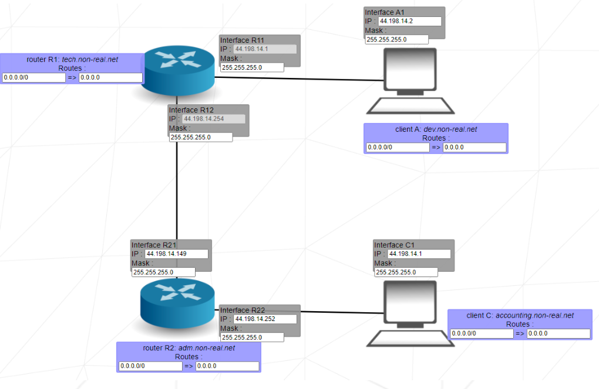

# Net_Practice

## 🌐 Project Overview

Net_Practice is a system administration project focused on network configuration and TCP/IP addressing. This project provides hands-on experience with configuring small-scale networks, understanding IP addressing, subnet masks, and routing tables through an interactive web-based interface.

Unlike coding projects, Net_Practice emphasizes practical networking knowledge through progressive exercises that simulate real-world network troubleshooting scenarios.

## 🔧 Implementation Details

### Network Concepts Covered

- **IP Addressing**: Configuring and troubleshooting IPv4 addresses
- **Subnet Masks**: Understanding and applying proper subnet masks
- **Network Segmentation**: Dividing networks into appropriate subnets
- **Routing**: Setting up routing tables and default gateways
- **Connectivity**: Ensuring communication between network segments

### Training Interface

The project uses a browser-based interface that presents 10 progressively challenging network configurations to fix:

- Each level presents a non-functioning network diagram
- Unshaded fields can be modified to correct the configuration
- Real-time validation of your solution
- Logging functionality to help diagnose issues

## 📊 Technical Concepts

### IP Address Fundamentals

IP addresses serve as unique identifiers for devices on a network, divided into:
- **Public IPs**: Globally unique and internet-accessible
- **Private IPs**: Used within local networks, not accessible from the internet

### Subnet Masks and CIDR Notation

Subnet masks divide IP addresses into network and host portions:

| CIDR Notation | Subnet Mask     | Total IPs | Common Use Case               |
|---------------|-----------------|-----------|-------------------------------|
| /30           | 255.255.255.252 | 4         | Point-to-point links          |
| /28           | 255.255.255.240 | 16        | Small office network          |
| /24           | 255.255.255.0   | 256       | Standard local network        |
| /16           | 255.255.0.0     | 65,536    | Large organization network    |

### Network Devices

- **Switches**: Connect multiple devices within a single network segment
- **Routers**: Connect different network segments and direct traffic between them

### Routing Tables

Routing tables contain information about available routes to different networks:
- **Destination**: The network address of the destination
- **Next Hop**: The IP address of the next router in the path
- **Default Route**: Used when no specific route matches (often shown as 0.0.0.0/0)

## 🚀 Approach to Solving Levels

### General Strategy

1. Identify the network topology (devices and connections)
2. Determine the required subnet masks for each network segment
3. Assign appropriate IP addresses within each subnet
4. Configure routing tables to enable cross-network communication
5. Test connectivity and troubleshoot using the logs

### Level-Specific Hints

#### Levels 1-3: Basic Connectivity
- Ensure devices on the same network segment have:
  - IP addresses within the same subnet range
  - Identical subnet masks

#### Levels 4-5: Router Configuration
- Properly configure router interfaces for each connected segment
- Ensure devices use their connected router interface as the default gateway

#### Levels 6-10: Advanced Routing
- Set up proper default routes
- Configure routing between multiple subnets
- Ensure consistent subnet masks within network segments
- Implement correct routes to the internet

## 📝 Learning Outcomes

Through this project, I gained practical knowledge in:

- **IP Addressing**: Understanding how IPv4 addressing and subnetting works
- **Network Configuration**: Applying proper network parameters for connectivity
- **Troubleshooting**: Identifying and resolving network configuration issues
- **Routing Concepts**: Implementing proper routing between network segments
- **CIDR Notation**: Using CIDR notation to define network ranges efficiently

## 🛠️ Project Structure

The repository contains:
- 10 level configuration files (one for each completed exercise)
- Documentation explaining the approach and solutions
- Reference materials for network concepts

## ⚠️ Note

As this project involves network configuration rather than coding, the deliverables are the configuration files for each level rather than source code. The files demonstrate the correct network parameters for each scenario.

For detailed project requirements, see the [net_practice.md](net_practice.md) file.

---

*This project is part of the 42 School Common Core curriculum.*